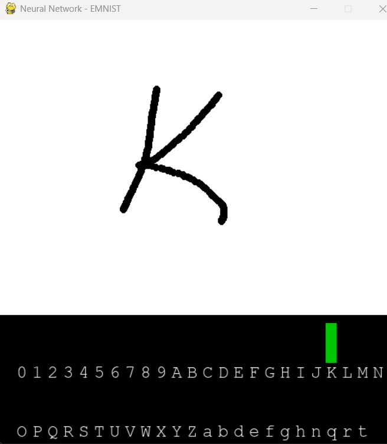
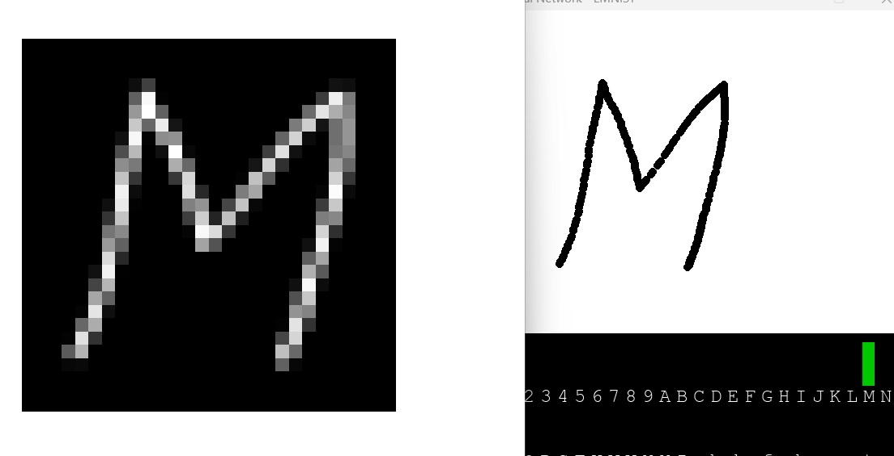

# Neural Network with EMNIST Datasets

## Overview

I'm working through Coursera's 'Deep Learning Specialization' (https://www.coursera.org/specializations/deep-learning), and was just wrapping up the 'Convolutional Neural Networks' course.

As a note, some previous work as I walked through the course here: (https://github.com/kevinmfox/mnist-neural-network)

I focused less this time around on _creating my own framework_ (so to speak), and more on implementing TensorFlow to have some fun with the EMNIST dataset (https://www.kaggle.com/datasets/crawford/emnist).

This is very similar to my previous application. You can train a neural network against various EMNIST datasets, and then run a pygame application to draw on the screen and see how your model performs.

It accepts a few parameters, and whatever model you're training against can be modified in the ```_myModel.py``` file.

The UI will _adapt_ to whatever EMNIST model is trained/used. So, if you train only against the number dataset, it will show digits 0 through 9. If you train against the letters dataset, it will show the alphabet.

I've included a ```model-001.pkl``` file which was trained against the _balanced_ dataset, and was a model recommended by ChatGPT. If you just want to try the UI, run: ```main.py --model_file model-001.pkl```

## Supported Arguments

- Ability to train a model (```--train```)
- Specity validation percentage (```--validation_size```)
- Specity testing percentage (```--testing_size```)
- Epochs (```--epochs```)
- Batch size (```--batch_size```)
- Read a model file (```--read_model```)
- Show charts from a model file (```--show_charts```)
- Create a dataset (useful for testing) (```--create_dataset```)
- Show an image from a dataset (```--show_image```)

## Installation

Download/clone the repo, and run:
```pip install -r requirements.txt```

You'll most likely want to grab the EMNIST datasets from this location: (https://www.kaggle.com/datasets/crawford/emnist)

I've included some smaller ZIP files of a few datasets that are usefule to play with.

Datasets should be kept in the ```datasets``` folder (the application assumes as much).

More information about the EMNIST datasets, formats, distributions, etc. can be found here: (https://www.kaggle.com/datasets/crawford/emnist)

If you want to create smaller subsets to train/model against, there's a command for that (see below).

## Creating Datasets

Create a dataset (useful for testing quickly):

```.\main.py --create_dataset --data_file emnist-balanced.csv --samples 1000```

## Training Models

__Note__: The model is in the ```_myModel.py``` file. Edit that however you see fit. It uses TensorFlow (https://www.tensorflow.org/).

```main.py --train --data_file subset.csv```

__Note__: By default the model will be saved to model.pkl (can change the file with ```--model_file```)

Show the cost & accuracy charts (```--show_charts```):

```main.py --train --data_file subset.csv --show_charts```

__Note__: Accuracy will only show if a validation set was specified.

Train with a Validation and Testing subset (specified in %):

```main.py --train --data_file subset.csv --validation_size 10 --testing_size 5```

## Reading Model Files

Read an existing model file (```--read_model```):

```main.py --read_model --model_file model.pkl```

This will show the parameters used to train the network.

Show charts from an existing model file:

```main.py --read_model --model_file model.pkl --show_charts```

## Other

Show a test image from a dataset (```--show_image```):

```main.py --data_file subset.csv --show_image --index 7```

## User Interface

The UI uses pygame to create/manage the interface.

Run the UI (will assume model.pkl as the model):

```main.py```

Run the UI with a specific model:

```main.py --model_file mymodel.pkl```

## User Interface Notes

You can draw in the white space, and the probability/guess (as determined by the model) of the result will be shown at the bottom.

</a>

Right-click to clear the drawing surface.

Press the 's' key to __show__ the image that is currently being interpreted.

</a>